# Data-analysis-platform
* A simple data analysis platform with visual and machine learning features  
  
  
  

  
  
  
## Table of Contents  
#### Part 1: Background  
#### Part II: Architecture  
#### Part III: Tools  
#### Part IV: Functions  
&emsp; 1. Data source display  
&emsp; 2. Visualization  
&emsp; 3. Machine learning  
  
  
## Part 1: Background  
The product's goal is BI, which provides data exploration and visualization, and integrates machine learning and prediction.  
  
  
  
  
## Part II: Architecture  
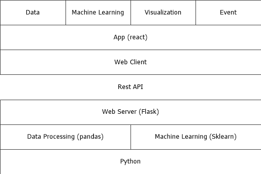

## Part III: Tools    
### 1.Client  
* bootstrap：Front frame, based on HTML, CSS, JAVASCRIPT  
* requirejs：JS dependency management  
* jquery：JavaScript library  
* reactjs：UI framework, based on components  
* d3js：JavaScript function library for data visualization  
* echarts：JavaScript function library for data visualization  
  
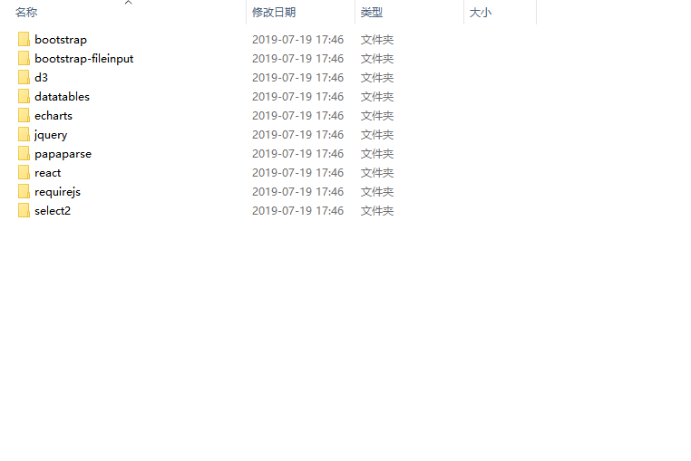
  
### 2.Server 
* flask:Python web framework  
* pandas:Python data structure and data analysis toolkit for data processing  
* sklearn:Python machine learning package, dependent on numpy, scipy, and matplotlib  

      from flask import Flask, request, make_response, redirect, url_for, jsonify
      from ml.classification import getClassifierByName, getClassifierNames
      from ml.regression import getRegressionByName, getRegressionModels
      from ml.cluster import getClusterByName, getClusterModels

### 3.Development tools
* nodejs:Server JavaScript environment  
* babel:Javascript compiler that supports transforming code into browser executable code  

## Part IV: Functions 

### 1. Data source display  
* Can add simple data files  
* Can customize display of data record lines per page  
* Can search data  
  
  
  
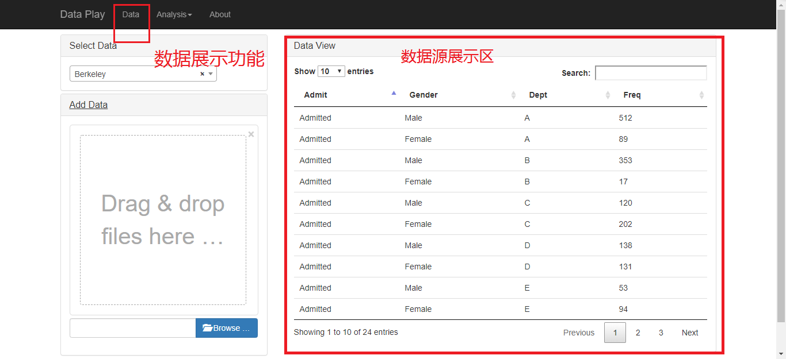

### 2.Visualization  
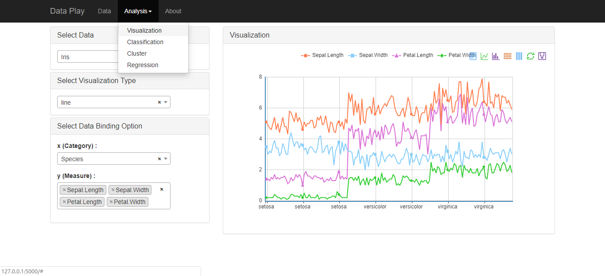  
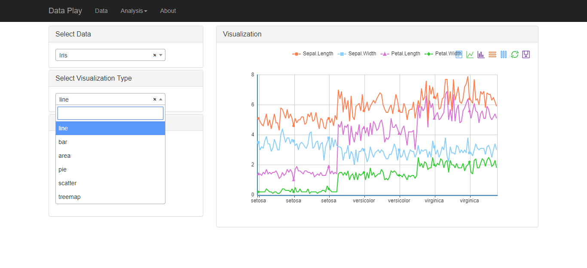  

###  line chart  
    define(["viz/xc1ymn"], function(Base) {
        var me = new Base();
        me.meta.name = "line";
        me.meta.chartName = "line";
        return me;
    });
    
###  bar chart  
    define(["viz/xc1ymn"], function(Base) {
        var me = new Base();
        me.meta.name = "bar";
        me.meta.chartName = "bar";
        return me;
    });

###  pie chart  
    define(["viz/c1m1"], function(Base) {
        var me = new Base();
        me.option.toolbox = {
            show: true,
            feature: {
                dataView: {
                    show: true,
                    readOnly: false
                },
                magicType: {
                    show: true,
                    type: ['pie', 'funnel'],
                    option: {
                        funnel: {
                            x: '25%',
                            width: '50%',
                            funnelAlign: 'left',
                            max: 1548
                        }
                    }
                },
                restore: {
                    show: true
                },
                saveAsImage: {
                    show: true
                }
            }
        };

        me.meta.name = "pie";
        me.meta.chartName = "pie";

        me.appendOption = function(option) {
            option.radius = '55%';
            option.center = ['50%', '60%'];
        }
        return me;
    });

###  tree chart  
    define(["viz/c1m1"], function(Base) {
        var me = new Base();
        me.meta.name = "treemap";
        me.meta.chartName = "treemap";

        me.option.toolbox = {
            show: true,
            feature: {
                dataView: {
                    show: true,
                    readOnly: false
                },
                restore: {
                    show: true
                },
                saveAsImage: {
                    show: true
                }
            }
        };

        me.appendOption = function(option) {
            option.itemStyle = {
                normal: {
                    label: {
                        show: true,
                        formatter: "{b}"
                    },
                    borderWidth: 1
                },
                emphasis: {
                    label: {
                        show: true
                    }
                }
            };
        }
        return me;
    });

###  scatter chart  
    define(["viz/xm1ym1cc1"], function(Base) {
        var me = new Base();
        me.meta.name = "scatter";
        me.meta.chartName = "scatter";
        return me;
    });

###  area chart   
    define(["viz/xc1ymn"], function(Base) {
        var me = new Base();
        me.meta.name = "area";
        me.meta.chartName = "line";
        me.appendOption = function(option) {
            option.itemStyle = {
                normal: {
                    areaStyle: {
                        type: 'default'
                    }
                }
            };
        }
        return me;
    });

### 3. Machine learning  
### 1) Classification model  
  
    class Classifier(BaseModel):

        def __init__(self):
            BaseModel.__init__(self)
            self._label = None
            self._features = None

        # train the model with given data set
        def train(self, data):
            self._features = data["features"]
            self._label = data["label"]
            self._model.fit(self._features, self._label)

        # train the model with given data set
        def getParameterDef(self):
            pass

        def setParameter(self, parameter):
            pass

        # predict the model with given dataset
        def predict(self, data):
            return self._model.predict(data)

        def predictViz(self, scale):
            # Predict Viz only available for two dimensional dataset
            if len(self._features[0]) != 2:
                return None

            result = dict()
            result["predict"] = list()
            result["data"] = list()

            # TODO leverage pandas to do this?
            range = dict()
            range["xmin"] = self._features[0][0]
            range["xmax"] = self._features[0][0]

            range["ymin"] = self._features[0][1]
            range["ymax"] = self._features[0][1]

            for item in self._features:
                if item[0] > range["xmax"]:
                    range["xmax"] = item[0]
                if item[0] < range["xmin"]:
                    range["xmin"] = item[0]
                if item[1] > range["ymax"]:
                    range["ymax"] = item[1]
                if item[1] < range["ymin"]:
                    range["ymin"] = item[1]

            xstep = (float(range["xmax"]) - float(range["xmin"])) / scale
            ystep = (float(range["ymax"]) - float(range["ymin"])) / scale

            for x in xrange(0, scale):
                dx = range["xmin"] + x * xstep
                dy = range["ymin"]
                for y in xrange(0, scale):
                    dy = dy + ystep
                    onePredict = self.predict([[dx, dy]])
                    record = dict()
                    record["x"] = dx
                    record["y"] = dy
                    record["label"] = onePredict[0]
                    result["predict"].append(record)

            for i in xrange(0, len(self._label) - 1):
                record = dict()
                record["x"] = self._features[i][0]
                record["y"] = self._features[i][1]
                record["label"] = self._label[i]
                result["data"].append(record)

            return result

### Classification models have KNN, Bayes, SVM  
  
  
  
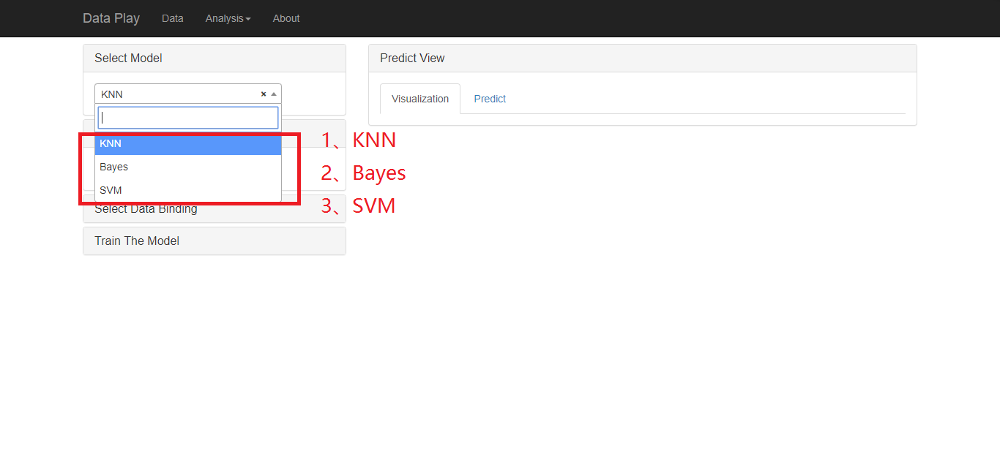
### KNN  
    class KNNClassifier(Classifier):

      def __init__(self):
          Classifier.__init__(self)
          self._name = "KNN"
          self._model = KNeighborsClassifier(n_neighbors=3)
  
  
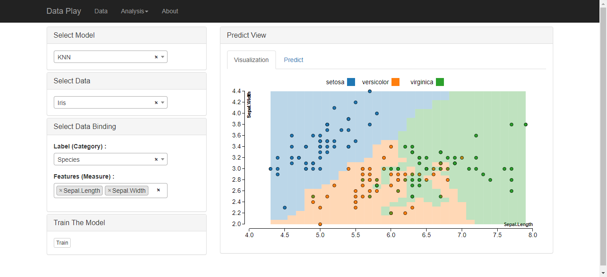
  
  
  
###  Bayes  
    class NBayesClassifier(Classifier):

      def __init__(self):
          Classifier.__init__(self)
          self._name = "Bayes"
          self._model = GaussianNB()
  
  
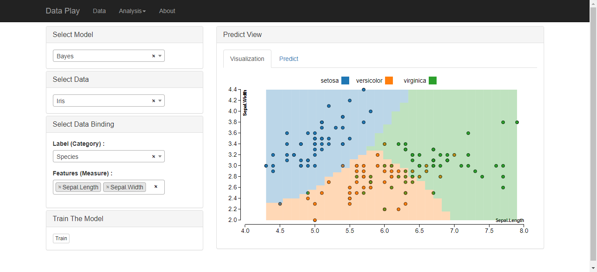
  
  
  
###  SVM  
    class SVMClassifier(Classifier):

      def __init__(self):
          Classifier.__init__(self)
          self._name = "SVM"
          self._model = svm.SVC()
  
  
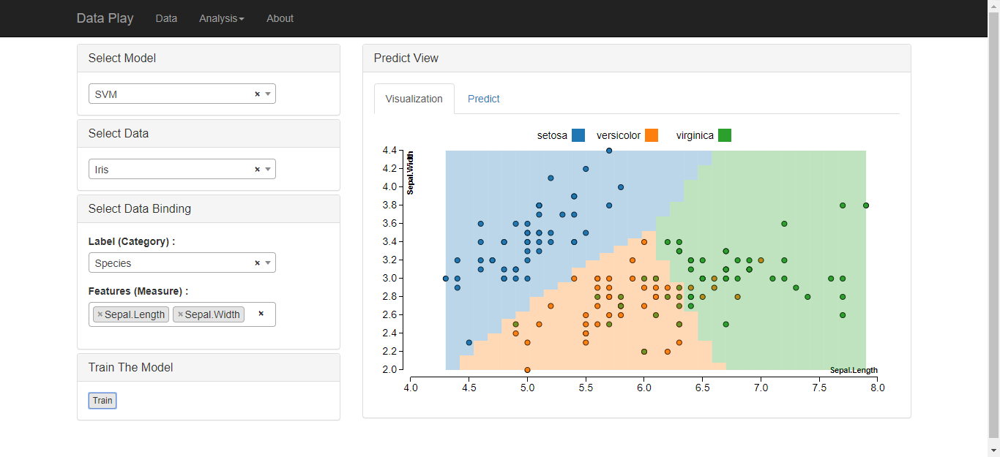
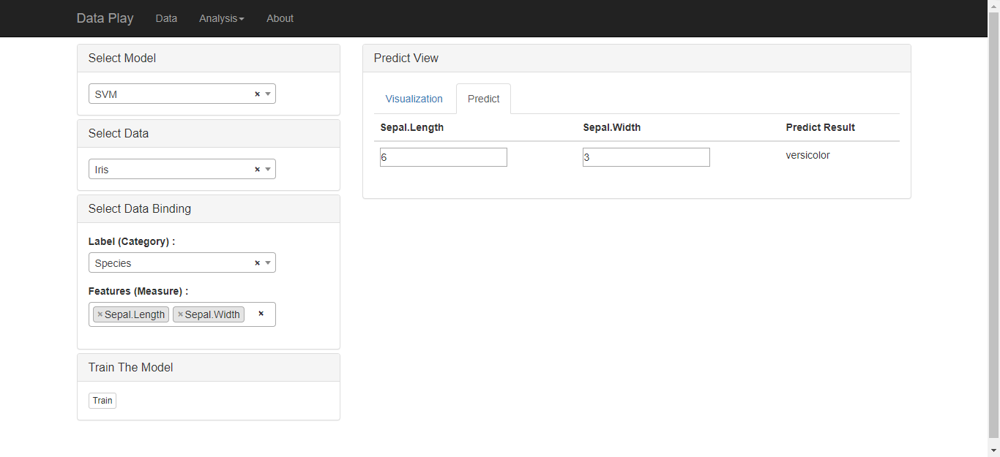

###  2) Clustering model  
 
    class Cluster(BaseModel):

        def __init__(self):
            BaseModel.__init__(self)
            self._features = None

        # train the model with given data set
        def train(self, data):
            self._features = data["train"]
            self._model.fit(self._features)

        # train the model with given data set
        def getParameterDef(self):
            pass

        def setParameter(self, parameter):
            pass

        # predict the model with given dataset
        def predict(self, data):
            return self._model.predict(data)

        def predictViz(self, scale):
            # Predict Viz only available for one dimensional dataset
            if len(self._features[0]) < 2:
                return None

            result = dict()
            result["predict"] = list()
            result["data"] = list()

            predict_train = self.predict(self._features)

            for i in xrange(0, len(self._features)):
                item = dict()
                item["x"] = self._features[i][0]
                item["y"] = self._features[i][1]
                item["label"] = predict_train[i]
                result["data"].append(item)

            # TODO leverage pandas to do this?
            range = dict()
            range["xmin"] = self._features[0][0]
            range["xmax"] = self._features[0][0]

            range["ymin"] = self._features[0][1]
            range["ymax"] = self._features[0][1]

            for item in self._features:
                if item[0] > range["xmax"]:
                    range["xmax"] = item[0]
                if item[0] < range["xmin"]:
                    range["xmin"] = item[0]
                if item[1] > range["ymax"]:
                    range["ymax"] = item[1]
                if item[1] < range["ymin"]:
                    range["ymin"] = item[1]

            xstep = (float(range["xmax"]) - float(range["xmin"])) / scale
            ystep = (float(range["ymax"]) - float(range["ymin"])) / scale

            for x in xrange(0, scale):
                dx = range["xmin"] + x * xstep
                dy = range["ymin"]
                for y in xrange(0, scale):
                    dy = dy + ystep
                    onePredict = self.predict([[dx, dy]])
                    record = dict()
                    record["x"] = dx
                    record["y"] = dy
                    record["label"] = onePredict[0]
                    result["predict"].append(record)

            return result

###  The clustering model has KMeans     
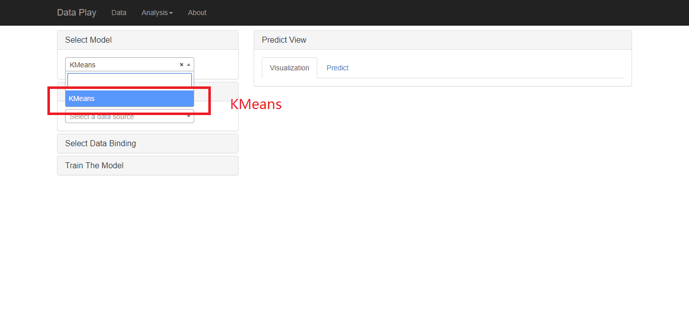
  
###  KMeans  

    class KMeansCluster(Cluster):

        def __init__(self):
            Cluster.__init__(self)
            self._name = "KMeans"
            self._model = KMeans(n_clusters=3)

        # train the model with given data set
        def getParameterDef(self):
            pass

        def setParameter(self, parameter):
            pass

    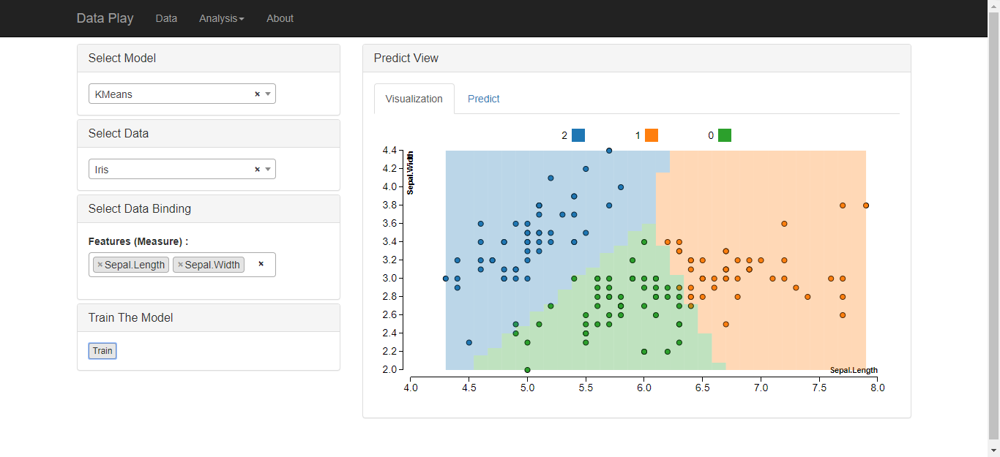
    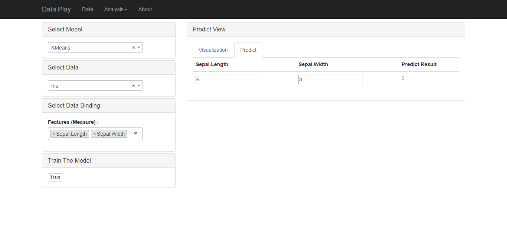

###  3) Regression model  

    class Regression(BaseModel):

        def __init__(self):
            BaseModel.__init__(self)
            self._features = None
            self._target = None

        # train the model with given data set
        def train(self, data):
            self._features = data["train"]
            self._target = data["target"]
            self._model.fit(self._features, self._target)

        # train the model with given data set
        def getParameterDef(self):
            pass

        def setParameter(self, parameter):
            pass

        # predict the model with given dataset
        def predict(self, data):
            return self._model.predict(data)

        def predictViz(self, scale):
            # Predict Viz only available for one dimensional dataset
            if len(self._features[0]) != 1:
                return None

            result = dict()
            result["predict"] = list()
            result["data"] = list()

            for i in xrange(0, len(self._features)):
                item = dict()
                item["x"] = self._features[i][0]
                item["y"] = self._target[i]
                result["data"].append(item)

            range = dict()
            range["xmin"] = self._features[0][0]
            range["xmax"] = self._features[0][0]

            for item in self._features:
                if item[0] > range["xmax"]:
                    range["xmax"] = item[0]
                if item[0] < range["xmin"]:
                    range["xmin"] = item[0]

            xstep = (float(range["xmax"]) - float(range["xmin"])) / scale

            for x in xrange(0, scale):
                dx = range["xmin"] + x * xstep

                onePredict = self.predict([[dx]])
                record = dict()
                record["x"] = dx
                record["y"] = onePredict[0]
                result["predict"].append(record)

            return result

  
###  Regression models have linear regression and logistic regression  
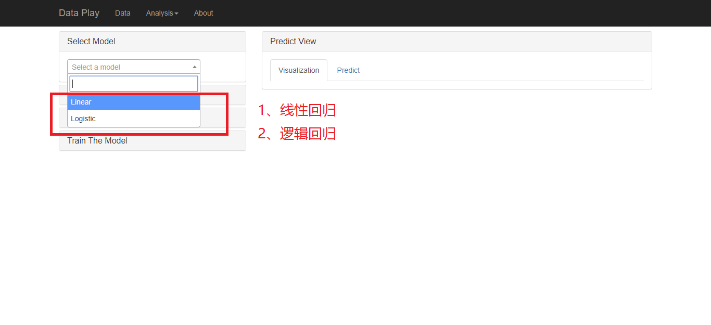  
  
  
  
###  linear 
  
    class LinearRegression(Regression):

        def __init__(self):
            Regression.__init__(self)
            self._name = "Linear"
            self._model = linear_model.LinearRegression()
        
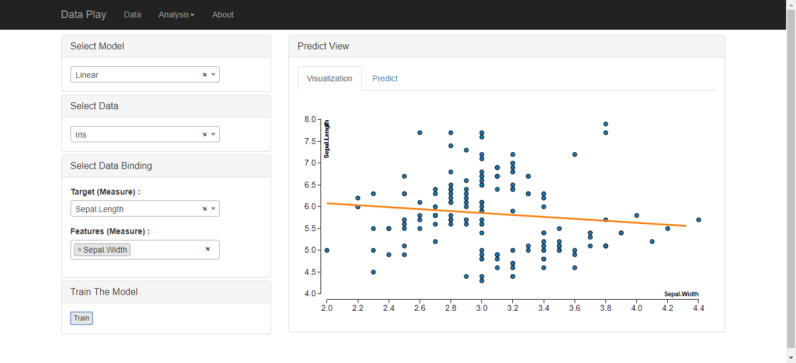
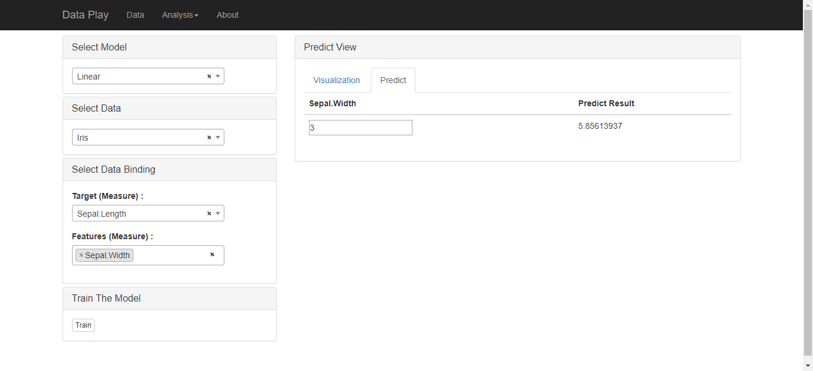  
  
  
  
###  logistic 
  
    class LogisticRegression(Regression):

        def __init__(self):
            Regression.__init__(self)
            self._name = "Logistic"
            self._model = linear_model.LogisticRegression(C=1e5)

        def predict_proba(self, data):
            return self._model.predict_proba(data)

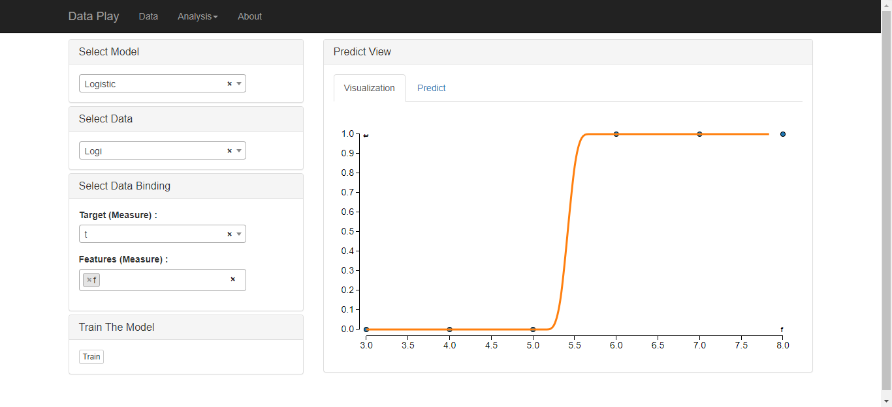
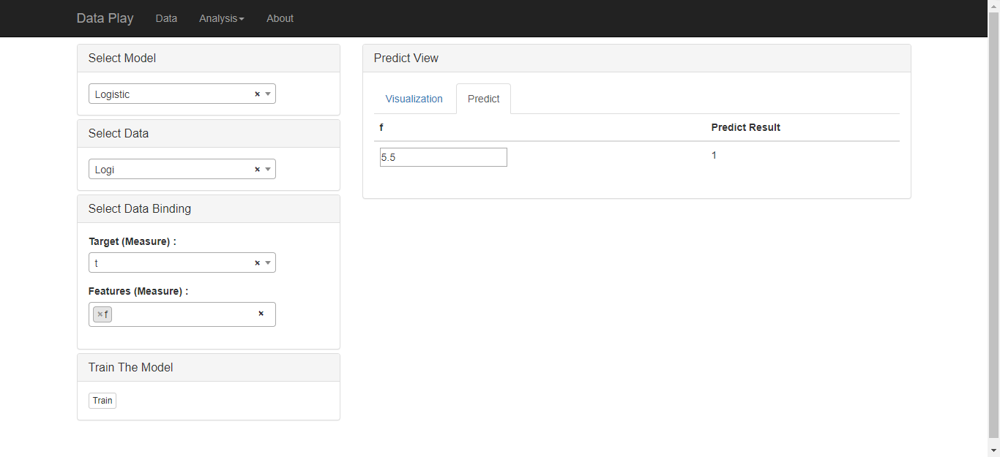

