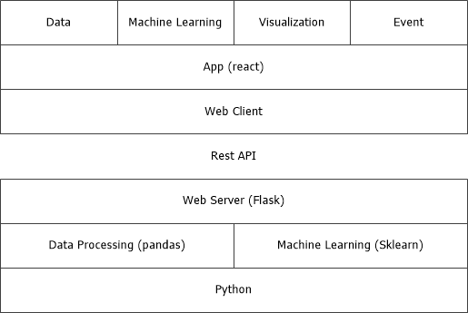
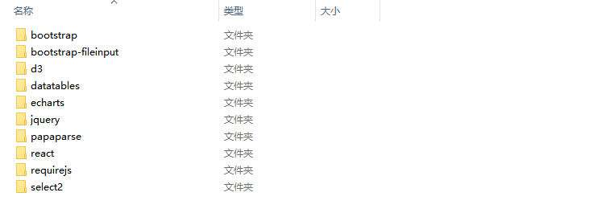
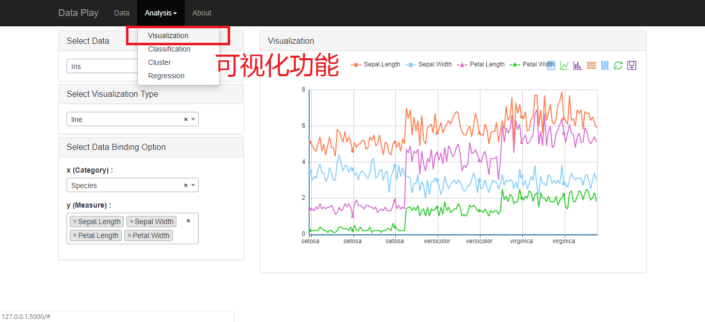
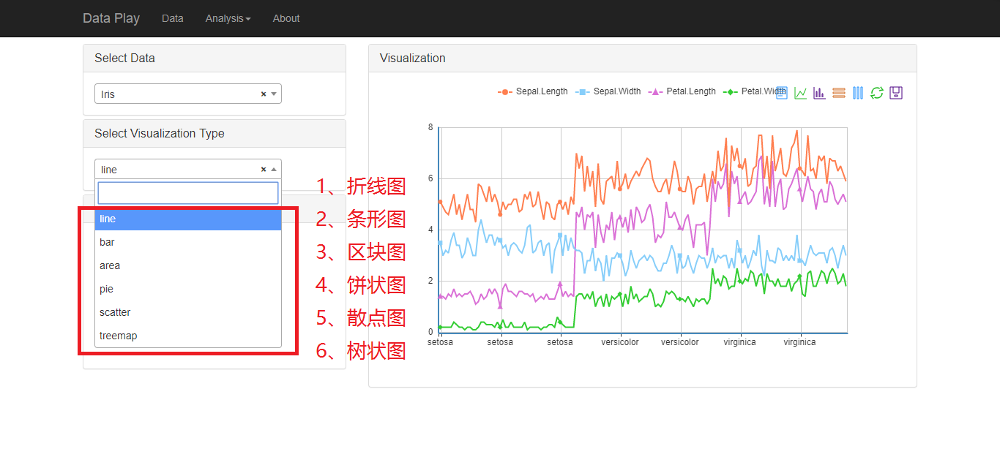

# Data-analysis-platform
A simple data analysis platform with visual and machine learning features  

  
  
  
## Table of Contents  
#### Part 1: Background  
#### Part II: Architecture  
#### Part III: Tools  
#### Part IV: Functions  
&emsp;&emsp; 1. Data source display  
&emsp;&emsp; 2.Visualization  
&emsp;&emsp; 3. Machine learning  
  
  
## Part 1: Background  
Trends: Big data has become a trend, and a large amount of data will emerge in all walks of life. How to use and explore the value of these data becomes the key.  
Domestic development: At present, a number of data analysis platform products have emerged in China. The goal of the product is BI, which provides visualization of data exploration functions and incorporates machine learning and prediction functions.  
  
  
## Part II: Architecture  

## Part III: Tools    
### 1.Client  
* bootstrap：Front frame, based on HTML, CSS, JAVASCRIPT  
* requirejs：JS dependency management  
* jquery：JavaScript library  
* reactjs：UI framework, based on components  
* d3js：JavaScript function library for data visualization  
* echarts：JavaScript function library for data visualization  
  
    

  
### 2.Server 
* flask:Python web framework  
* pandas:Python data structure and data analysis toolkit for data processing  
* sklearn:Python machine learning package, dependent on numpy, scipy, and matplotlib  

### 3.Development tools
* nodejs:Server JavaScript environment  
* babel:Javascript compiler that supports transforming code into browser executable code  

## Part IV: Functions 

### 1. Data source display  
* Can add simple data files  
* Can customize display of data record lines per page  
* Can search data  
  
  
  

### 2.Visualization  
* There are 6 types of visual graphics that can be selected: line chart, bar chart, pie chart, tree chart, scatter chart, area chart  
* Quickly switch to data view, line chart, bar chart, stacked chart, tile chart  
* Can dynamically get data points  
* Store and restore the visualized result graph    
  
  
  

### 3. Machine learning  

1)Classification model  
* Classification models have KNN, Bayes, SVM  
  
  
  

* KNN  
  
  
  

* Bayes  
  
  
  

* SVM  
  
  
  

2)Clustering model  
* The clustering model has KMeans    
  
  
  

  
* KMeans  
  
  
  

3)Regression model  
* Regression models have linear regression and logistic regression  

* linear

* logistic

